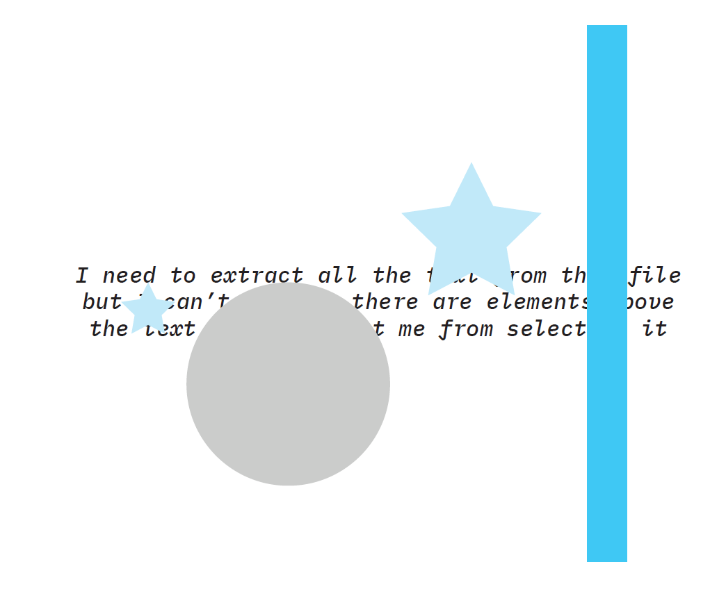
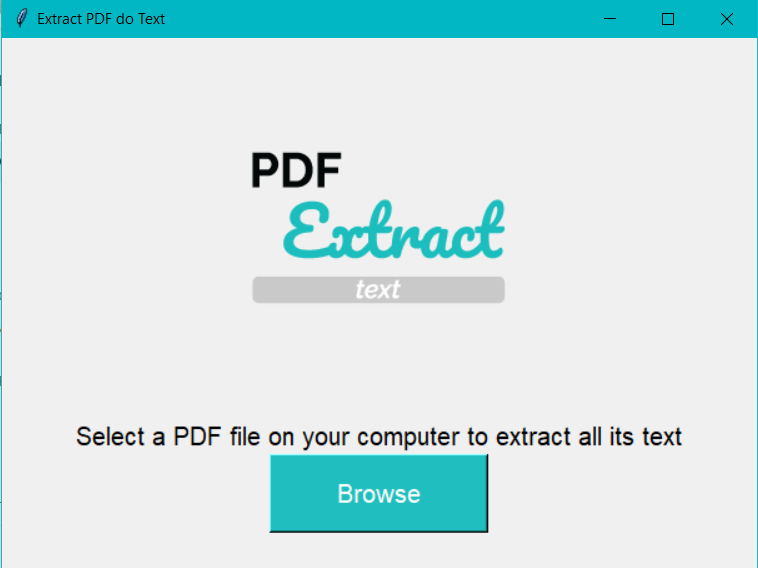
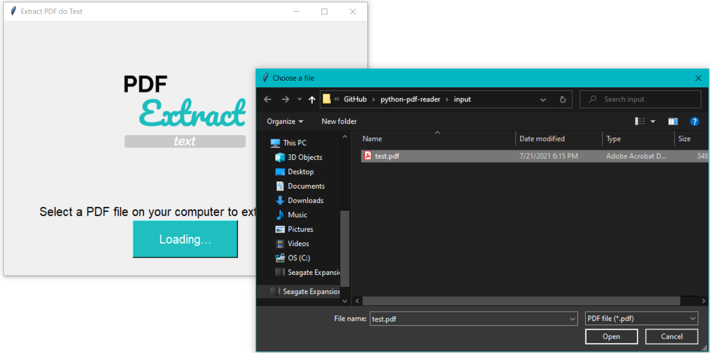
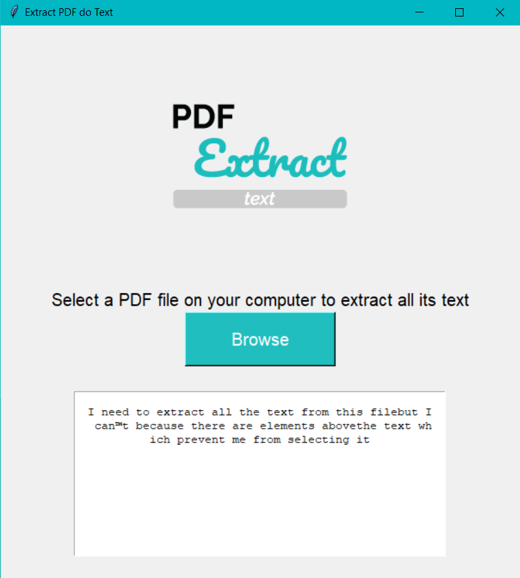

# Python PDF Reader

Extract the text in a PDF file.

# Steps to extract text

## Original PDF
 

## Open de app
 

## Browse a file
 

## Extract the text
 

## References
<li> https://www.youtube.com/watch?v=y8PR4lTAh5E </li>